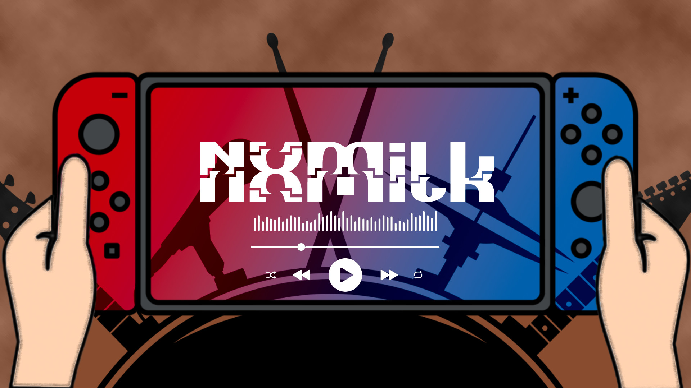
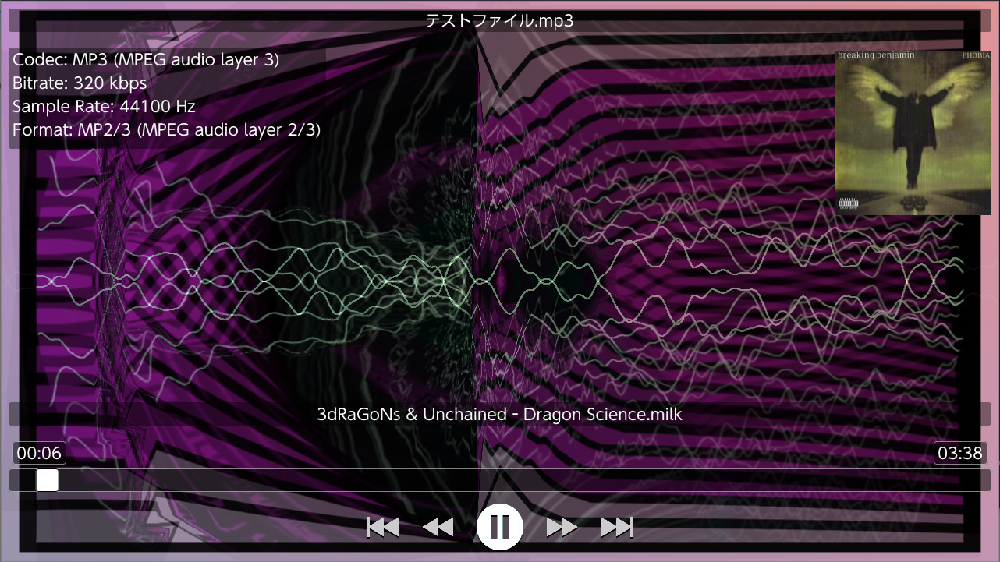

NXMilk
======


NXMilk is a trivial audio player for Nintendo Switch.

It uses FFMpeg (with the help of some libs) for audio decoding and projectM for the vis.
The GUI is made with ImGui.

This project started as a test class for new audio player for NXMP

NXMilk is coded by proconsule


Features
-----
- Wide audio file format support (See below)
- Vis using projectM library
- Support Japanese,Chinese,Korean Cyrilic fonts
- Can read from SD card and from USB storage

### Supported Files (using ffmpeg)

- MP3 support (with ID3 tag support)
- OGG support (with metadata support if present)
- FLAC support (with metadata support if present)
- WAV support
- AC3 support
- AAC support
- Many others (ffmpeg is great!) you can unfilter file extensions with config file ini 

### Supported Files using libopenmpt (https://lib.openmpt.org/libopenmpt/)

- Composer 667 (.667)
- Composer 669 / UNIS 669 (.669)
- ASYLUM Music Format / Advanced Music Format (.amf / .dmf)
- Extreme’s Tracker / Velvet Studio (.ams)
- Composer 670 / CDFM (.c67)
- Digi Booster Pro (.dbm)
- Digi Booster (.digi)
- X-Tracker (.dmf)
- DSIK (.dsm)
- Dynamic Studio (.dsm)
- Digital Symphony (.dsym)
- Digital Tracker / Digital Home Studio (.dtm)
- Farandole Composer (.far)
- Davey W. Taylor’s FM Tracker (.fmt)
- General Digital Music (.gdm)
- Graoumf Tracker 1 (.gtk / .gt2)
- Ice Tracker / SoundTracker 2.6 (.ice / .st26)
- Imago Orpheus (.imf)
- Impulse Tracker Project (.itp) – legacy OpenMPT format with instruments stored in external files rather than directly in the module
- Jazz Jackrabbit 2 Music (.j2b)
- SoundTracker and compatible (.m15 / .stk)
- DigiTrakker (.mdl)
- OctaMED (.med)
- MO3 (.mo3)
- MadTracker 2 (.mt2)
- MultiTracker (.mtm)
- Psycho Pinball / Micro Machines 2 music format (.mus)
- Oktalyzer (.okt)
- OggMod-compressed XM files (.oxm)
- Epic Megagames MASI (.psm)
- Disorder Tracker 2 (.plm)
- ProTracker 3.6 IFF (.pt36)
- PolyTracker (.ptm)
- SoundFX / MultiMedia Sound (.sfx / .sfx2 / .mms)
- Scream Tracker 2 (.stm)
- Scream Tracker Music Interface Kit (.stx)
- Soundtracker Pro II (.stp)
- Symphonie / Symphonie Pro (.symmod)
- UltraTracker (.ult)
- Unreal Music (.umx) only from Unreal (Tournament 1), Deus Ex and Jazz Jackrabbit 3D
- Mod's Grave (.wow)
- Astroidea XMF (.xmf)

### Supported Files using libgme (https://github.com/mcfiredrill/libgme)

- AY        ZX Spectrum/Amstrad CPC
- GBS       Nintendo Game Boy
- GYM       Sega Genesis/Mega Drive
- HES       NEC TurboGrafx-16/PC Engine
- KSS       MSX Home Computer/other Z80 systems (doesn't support FM sound)
- NSF/NSFE  Nintendo NES/Famicom (with VRC 6, Namco 106, and FME-7 sound)
- SAP       Atari systems using POKEY sound chip
- SPC       Super Nintendo/Super Famicom
- VGM/VGZ   Sega Master System/Mark III, Sega Genesis/Mega Drive,BBC Micro

### Supported Files using libmodplug (https://github.com/Konstanty/libmodplug)
- Nearly all the formats supported by libopenmpt
- MIDI files (for better result you must use GUS patch file https://www.chocolate-doom.org/wiki/index.php/GUS) 


Button Mapping
-----
- ZL/ZR Prev/Next Preset
- L/R Seek -/+ 5 seconds
- B Stop
- Y Disable projectM Vis
- Limited Touch Support

USB
-----
Press Y to toogle between SD Card and USB


Installation 
----
- Copy NXMilk.nro in a subfolder eg. /switch/NXMilk/
- (OPTIONAL) Copy milk files in /switch/NXMilk/presets/milk/
- (OPTIONAL) Copy texture files in /switch/NXMilk/presets/Textures/
- (OPTIONAL) Copy timidity.conf and GUS patch files in /switch/NXMilk/timidity/


Edit Config file NXMilk.ini

```
[AudioPlayer]
startpath = /switch/NXMilk
milkpresetspath = /switch/NXMilk/presets/milk/
milktexturespath = /switch/NXMilk/presets/Textures/
interfacehidesec = 10
usebuiltinpreset = true
```

Since file extensions for audio file can be very "exotic" starting from version 0.1.0 enabled extension can be added also on config file
```
[AudioPlayer]
startpath = /switch/NXMilk
milkpresetspath = /switch/NXMilk/presets/milk/
milktexturespath = /switch/NXMilk/presets/Textures/
interfacehidesec = 10
usebuiltinpreset = true
enabled_extensions = .aac,.ac3,.wav
```
NXMilk uses ffmpeg along with many other libraries so the supported files list is HUGE


NXMilk has some builtin presets. Can be disabled setting to false the usebuiltinpreset option


Presets
----
- Many milkdrop presets to use https://github.com/projectM-visualizer/presets-cream-of-the-crop

Libraries used in this project
-----
- FFMpeg https://ffmpeg.org/
- ImGui https://github.com/ocornut/imgui
- projectM https://github.com/projectM-visualizer/projectm
- libopenmpt https://lib.openmpt.org/libopenmpt/
- libgme https://github.com/mcfiredrill/libgme
- libmodplug https://github.com/Konstanty/libmodplug
- Many code parts are taken form NXMP https://github.com/proconsule/nxmp

Thanks to
-----
- spkatsi @GBATemp forum for icons,banner, testing and suggestions
- Djakku @GBATemp for testing and suggestions

Screenshots
-----

